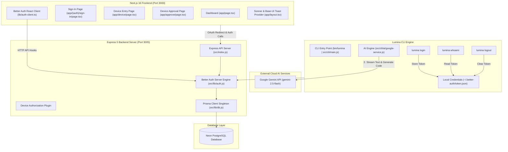
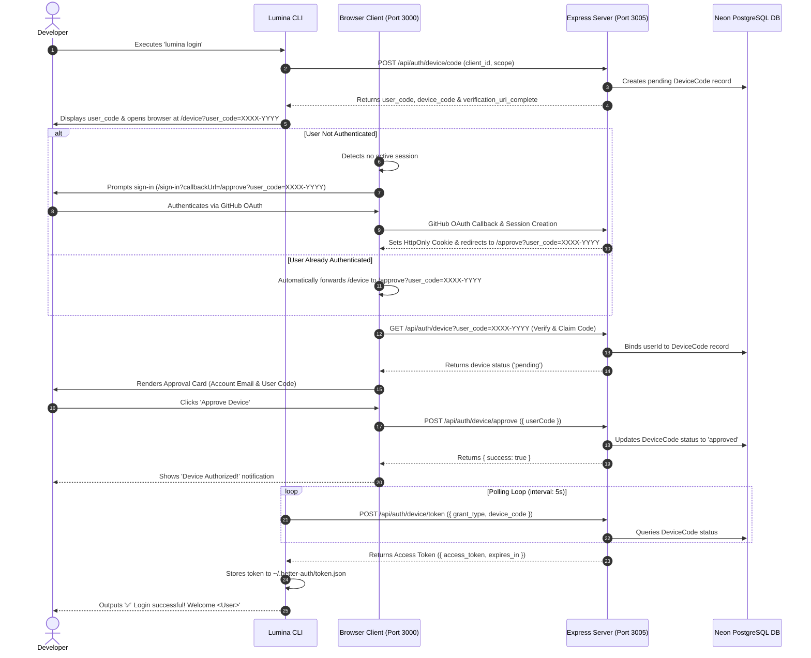
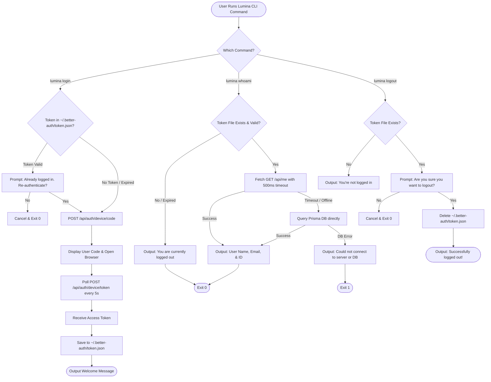
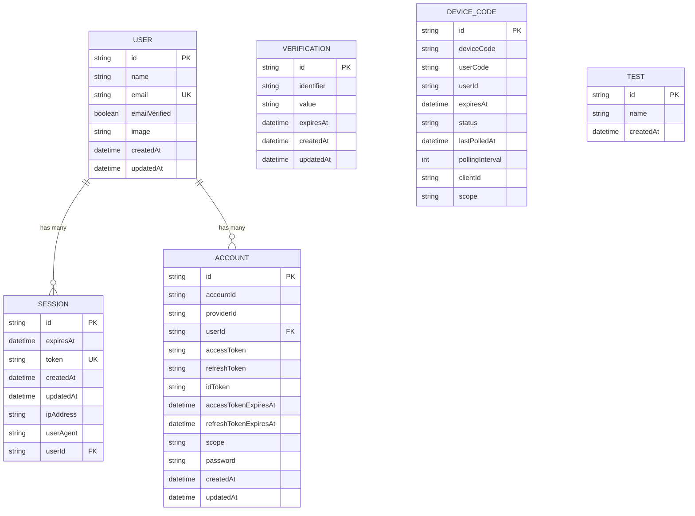

# ✨ Lumina & LuminaCLI — Autonomous AI Software Engineering Agent & Web Platform

<p align="center">
  <b>An Autonomous AI Software Engineering Agent that helps developers build, analyze, debug, and automate workflows directly from the terminal, paired with a Next.js 16 & Express 5 Web Platform.</b>
</p>

<p align="center">
  TypeScript • Node.js • Gemini AI (gemini-2.5-flash) • Vercel AI SDK • Next.js 16 • React 19 • Express.js 5 • Better Auth • Prisma ORM • PostgreSQL (Neon DB) • Tailwind CSS
</p>

---

## 📋 Table of Contents

- [🚀 Overview](#-overview)
- [🎯 Core Goals](#-core-goals)
- [✨ Features & Agent Capabilities](#-features--agent-capabilities)
- [🤖 Google Gemini AI Engine Architecture](#-google-gemini-ai-engine-architecture)
- [📊 Comprehensive Visual Architecture (Mermaid Flowcharts & Graphs)](#-comprehensive-visual-architecture-mermaid-flowcharts--graphs)
  - [1. Monorepo System Topology](#1-monorepo-system-topology)
  - [2. End-to-End CLI Device Authorization Sequence](#2-end-to-end-cli-device-authorization-sequence)
  - [3. CLI Auth Commands Decision Tree](#3-cli-auth-commands-decision-tree)
  - [4. Database Entity Relationship Diagram (ERD)](#4-database-entity-relationship-diagram-erd)
- [🏗️ Monorepo Structure & File Map](#️-monorepo-structure--file-map)
- [🛠️ Technology Stack](#️-technology-stack)
- [🔐 Authentication System Details](#-authentication-system-details)
- [🗄️ Database Schema Specification](#️-database-schema-specification)
- [💻 CLI Commands Reference](#-cli-commands-reference)
- [⚙️ Environment Variables Setup](#️-environment-variables-setup)
- [🛠️ Setup & Running Locally](#️-setup--running-locally)
- [📡 API Endpoints Reference](#-api-endpoints-reference)
- [🐛 Solved Edge Cases & Troubleshooting Guide](#-solved-edge-cases--troubleshooting-guide)
- [👨‍💻 Author & License](#-author--license)

---

## 🚀 Overview

**LuminaCLI** is an AI-powered command-line software engineering agent designed to act as an autonomous developer assistant. Powered by **Google Gemini 2.5 Flash** (`@ai-sdk/google`) and Vercel AI SDK (`ai`), LuminaCLI can:

- Understand complex multi-file development tasks
- Plan technical implementations autonomously
- Create, modify, and refactor codebase files
- Stream responses in real-time using `streamText`
- Execute shell & terminal development commands
- Perform online web search and documentation lookups
- Maintain persistent conversation memory
- Authenticate securely via GitHub OAuth 2.0 and OAuth Device Authorization Flow

It pairs a terminal-based CLI binary agent (`lumina`) with a full-stack web application featuring an **Express 5** backend server (powered by **Better Auth** and **Prisma ORM** over PostgreSQL) and a modern **Next.js 16** frontend dashboard (utilizing **React 19**, **Tailwind CSS**, **Sonner**, and **Shadcn UI**).

---

## 🎯 Core Goals

- **Terminal-First AI Pair Programmer**: Enable developers to analyze and modify code directly inside their command prompt.
- **Google Gemini-Powered Intelligence**: Leverage `gemini-2.5-flash` with Vercel AI SDK for ultra-fast, high-reasoning code generation and streaming responses.
- **Autonomous Task Execution**: Follow structured planning workflows (`Plan` -> `Execute` -> `Test` -> `Verify`).
- **Context-Aware Memory**: Retain codebase awareness across commands and developer sessions.
- **Enterprise-Grade Security**: Secure CLI authentication using standard OAuth 2.0 Device Code Authorization (RFC 8628).

---

## ✨ Features & Agent Capabilities

### 🤖 1. Interactive Terminal Assistant & Gemini AI Service
Command-line assistant powered by `AIService` (`server/src/cli/ai/google-service.js`) with support for text streaming (`sendMessage`), non-streaming responses (`getMessage`), and structured schema generation (`generateObject`).

### 🧠 2. Autonomous Agent Planning
Deconstructs complex user prompts into step-by-step technical plans before executing code changes.

### 🔧 3. Intelligent Tool Execution
Safely executes filesystem modifications, shell commands, code syntax validation, git operations, and web searches.

### 🔐 4. OAuth Device Authorization (RFC 8628)
Enables headless terminal authentication via browser verification.

### ⚡ 5. Resilient Resilience Engine
Features fast-path API session queries, abort timeouts, and automatic fallback database lookups.

---

## 🤖 Google Gemini AI Engine Architecture

Lumina CLI uses the Vercel AI SDK (`ai`) and Google provider (`@ai-sdk/google`) configured in [`server/src/config/google.config.js`](file:///d:/lumina/server/src/config/google.config.js) and [`server/src/cli/ai/google-service.js`](file:///d:/lumina/server/src/cli/ai/google-service.js):

### 1. Configuration (`server/src/config/google.config.js`)
```javascript
import dotenv from 'dotenv';
dotenv.config();

export const config = {
  googleApiKey: process.env.GOOGLE_GENERATIVE_AI_API_KEY || '',
  model: process.env.LUMINA_MODEL || 'gemini-2.5-flash',
};
```

### 2. AI Service Implementation (`server/src/cli/ai/google-service.js`)
```javascript
import { google } from "@ai-sdk/google";
import { streamText, generateObject } from "ai";
import { config } from "../../config/google.config.js";

export class AIService {
  constructor() {
    if (!config.googleApiKey) {
      throw new Error("GOOGLE_GENERATIVE_AI_API_KEY is not set in environment variables");
    }
    
    this.model = google(config.model, {
      apiKey: config.googleApiKey,
    });
  }

  async sendMessage(messages, onChunk) {
    const result = streamText({
      model: this.model,
      messages: messages
    });
    
    let fullResponse = "";
    for await (const chunk of result.textStream) {
      fullResponse += chunk;
      if (onChunk) onChunk(chunk);
    }

    const fullResult = await result;
    return {
      content: fullResponse,
      finishReason: fullResult.finishReason,
      usage: fullResult.usage,
    };
  }

  async getMessage(messages) {
    let fullResponse = "";
    await this.sendMessage(messages, (chunk) => {
      fullResponse += chunk;
    });
    return fullResponse;
  }
}
```

---

## 📊 Comprehensive Visual Architecture (Mermaid Flowcharts & Graphs)

### 1. Monorepo System Topology

The diagram below illustrates the relationship between the terminal CLI client, Gemini AI engine, Next.js web application, Express 5 backend server, and the cloud Neon PostgreSQL database.



---

### 2. End-to-End CLI Device Authorization Sequence

This diagram details the exact sequence of events when a developer executes `lumina login`, approves the request in the browser, and receives an authentication token in the terminal.



---

### 3. CLI Auth Commands Decision Tree

Flowchart showing how `login`, `whoami`, and `logout` evaluate credentials and execute.



---

### 4. Database Entity Relationship Diagram (ERD)

The complete Prisma relational model for users, sessions, accounts, verifications, and device authorization codes.



---

## 🏗️ Monorepo Structure & File Map

```text
lumina/
├── client/                             # Next.js 16 Frontend Web Application (Port 3000)
│   ├── app/                            # Next.js App Router
│   │   ├── (auth)/                     # Auth Route Group
│   │   │   └── sign-in/page.tsx        # GitHub Social Sign-In Page & callbackUrl Handler
│   │   ├── approve/page.tsx            # Device Authorization Review & Approval Page
│   │   ├── device/page.tsx             # Device Code Entry Page & Automatic Forwarder
│   │   ├── globals.css                 # CSS Design System Tokens & Utility Classes
│   │   ├── layout.tsx                  # Root Layout (ThemeProvider, Base-UI & Sonner Toasters)
│   │   └── page.tsx                    # Protected Dashboard Page
│   ├── components/                     # Reusable UI Components
│   │   ├── login-form.tsx              # GitHub Login Component
│   │   ├── theme-provider.tsx          # NextThemes Provider Configuration
│   │   └── ui/                         # Shadcn UI Components (Button, Card, Spinner, Toast, etc.)
│   ├── lib/                            # Frontend Utilities & Auth Client
│   │   ├── auth-client.ts              # Better Auth React Client (`better-auth/react`)
│   │   └── utils.ts                    # Class Merger (`clsx` + `tailwind-merge`)
│   └── package.json                    # Client Dependencies (`sonner`, `@base-ui/react`, Next 16)
│
├── server/                             # Express 5 Backend API Server & CLI Package (Port 3005)
│   ├── prisma/                         # Prisma Database Setup
│   │   └── schema.prisma               # Relational Schema Specification
│   ├── src/
│   │   ├── cli/                        # Lumina CLI Implementation
│   │   │   ├── ai/                     # AI Engine & Provider Services
│   │   │   │   └── google-service.js   # Gemini AI Service (`streamText`, `sendMessage`, `getMessage`)
│   │   │   ├── commands/auth/login.js  # CLI login, logout, & whoami Action Handlers
│   │   │   └── main.js                 # CLI Binary Entry Point, ASCII Figlet & Commander Setup
│   │   ├── config/                     # Server & AI Configurations
│   │   │   └── google.config.js        # Google Generative AI Model & API Key Configuration
│   │   ├── lib/                        # Server Shared Libraries
│   │   │   ├── auth.js                 # Better Auth Express Instance & Device Authorization Plugin
│   │   │   ├── db.js                   # Prisma Client & PostgreSQL Connection Pool Instance
│   │   │   └── token.js                # Token File Utilities (~/.better-auth/token.json)
│   │   └── index.js                    # Express Application Entry Point (/api/auth/*, /api/me)
│   ├── .env                            # Backend Server Environment Variables
│   └── package.json                    # Server Dependencies (`@ai-sdk/google`, `ai`, `better-auth`)
│
└── README.md                           # Master Architecture Documentation
```

---

## 🛠️ Technology Stack

### Frontend (`client/`)
| Technology | Version | Purpose |
| :--- | :--- | :--- |
| **Next.js** | `16.3.0` | App Router React Framework |
| **React** | `19.2.8` | UI Rendering Engine |
| **Tailwind CSS** | `4.x` | Utility-First Styling Framework |
| **Sonner** | `2.0.8` | Toast Notification System |
| **Better Auth Client** | `1.6.27` | React Auth Hooks (`better-auth/react`) |
| **Lucide React** | `1.29.0` | Vector UI Icons |

### Backend & CLI (`server/`)
| Technology | Version | Purpose |
| :--- | :--- | :--- |
| **Node.js** | `>= 18.x` | JavaScript Runtime (ES Modules) |
| **Google Gemini AI** | `@ai-sdk/google` | Generative AI Provider (`gemini-2.5-flash`) |
| **Vercel AI SDK** | `ai` | AI Streaming & Structured Object Generation |
| **Express** | `5.2.1` | HTTP Server & Web API Routing |
| **Better Auth Server** | `1.6.27` | Auth Engine & Device Authorization Plugin |
| **Prisma ORM** | `7.9.1` | Database ORM & Migrations |
| **PostgreSQL** | `Neon DB` | Cloud Serverless Database |
| **Commander.js** | `15.0.0` | CLI Command Router |
| **Clack Prompts** | `1.7.0` | Interactive CLI Prompts & Confirmations |
| **Chalk & Figlet** | Latest | ASCII Banners & Colored Output |

---

## 🔐 Authentication System Details

### 1. GitHub Social OAuth 2.0
- Initiated via `authClient.signIn.social({ provider: "github", callbackURL: targetCallback })`.
- Better Auth handles OAuth authorization exchange with GitHub API.
- Automatically generates and stores user session records in PostgreSQL `session` table and issues HttpOnly session cookies.

### 2. OAuth Device Authorization (RFC 8628)
- Configured in `server/src/lib/auth.js`:
  ```javascript
  plugins: [
    deviceAuthorization({ 
      verificationUri: "http://localhost:3000/device", 
    }), 
  ]
  ```
- Exposes device endpoints:
  - `POST /api/auth/device/code`: Generates `user_code` (e.g. `ZBVDU99D`) and `device_code`.
  - `GET /api/auth/device?user_code=...`: Verifies code and **claims `userId`** for active session.
  - `POST /api/auth/device/approve`: Sets status to `"approved"`.
  - `POST /api/auth/device/deny`: Sets status to `"denied"`.
  - `POST /api/auth/device/token`: Polls status and returns access token upon approval.

---

## 🗄️ Database Schema Specification

Below is the complete database model defined in [`server/prisma/schema.prisma`](file:///d:/lumina/server/prisma/schema.prisma):

```prisma
datasource db {
  provider = "postgresql"
  url      = env("DATABASE_URL")
}

generator client {
  provider = "prisma-client-js"
}

model User {
  id            String    @id
  name          String
  email         String    @unique
  emailVerified Boolean   @default(false)
  image         String?
  createdAt     DateTime  @default(now())
  updatedAt     DateTime  @updatedAt
  sessions      Session[]
  accounts      Account[]

  @@map("user")
}

model Session {
  id        String   @id
  expiresAt DateTime
  token     String   @unique
  createdAt DateTime @default(now())
  updatedAt DateTime @updatedAt
  ipAddress String?
  userAgent String?
  userId    String
  user      User     @relation(fields: [userId], references: [id], onDelete: Cascade)

  @@index([userId])
  @@map("session")
}

model Account {
  id                    String    @id
  accountId             String
  providerId            String
  userId                String
  user                  User      @relation(fields: [userId], references: [id], onDelete: Cascade)
  accessToken           String?
  refreshToken          String?
  idToken               String?
  accessTokenExpiresAt  DateTime?
  refreshTokenExpiresAt DateTime?
  scope                 String?
  password              String?
  createdAt             DateTime  @default(now())
  updatedAt             DateTime  @updatedAt

  @@index([userId])
  @@map("account")
}

model Verification {
  id         String   @id
  identifier String
  value      String
  expiresAt  DateTime
  createdAt  DateTime @default(now())
  updatedAt  DateTime @updatedAt

  @@index([identifier])
  @@map("verification")
}

model DeviceCode {
  id              String    @id
  deviceCode      String
  userCode        String
  userId          String?
  expiresAt       DateTime
  status          String
  lastPolledAt    DateTime?
  pollingInterval Int?
  clientId        String?
  scope           String?

  @@map("deviceCode")
}
```

---

## 💻 CLI Commands Reference

You can run `lumina` commands from any directory terminal once linked (`npm link` inside `server/`).

### 1. `lumina login`
Initiates device authorization flow, displays user code, opens browser, and polls for token authorization.
```bash
lumina login
```
Options:
- `--server-url <url>`: Specify custom backend auth server (default: `http://localhost:3005`).
- `--client-id <id>`: Specify custom OAuth client ID.

### 2. `lumina whoami`
Displays current authenticated user details (Name, Email, ID). Works smoothly when logged in or logged out.
```bash
lumina whoami
```

### 3. `lumina logout`
Prompts confirmation and clears local credentials from `~/.better-auth/token.json`.
```bash
lumina logout
```

---

## ⚙️ Environment Variables Setup

Create a `.env` file in the `server/` directory (`server/.env`):

```env
PORT=3005

# PostgreSQL Database Connection Strings (Neon DB with verify-full SSL mode)
DATABASE_URL="postgresql://neondb_owner:<password>@<host>/neondb?sslmode=verify-full&channel_binding=require"
DIRECT_URL="postgresql://neondb_owner:<password>@<host>/neondb?sslmode=verify-full"

# Better Auth Secret & Public URL
BETTER_AUTH_SECRET=your_generated_secret_key_here
BETTER_AUTH_URL=http://localhost:3005

# GitHub OAuth App Credentials
GITHUB_CLIENT_ID=your_github_client_id
GITHUB_CLIENT_SECRET=your_github_client_secret

# Google Gemini AI Config
GOOGLE_GENERATIVE_AI_API_KEY=your_google_ai_api_key_here
LUMINA_MODEL=gemini-2.5-flash
```

---

## 🛠️ Setup & Running Locally

### 1. Install Monorepo Dependencies
```bash
cd server && npm install
cd ../client && npm install
```

### 2. Link CLI Binary (Global Command)
```bash
cd server
npm link
```

### 3. Push Database Schema
```bash
cd server
npx prisma db push
```

### 4. Start Backend Server
```bash
cd server
npm run dev
```
*Listens at `http://localhost:3005`.*

### 5. Start Next.js Frontend
```bash
cd client
npm run dev
```
*Listens at `http://localhost:3000`.*

---

## 📡 API Endpoints Reference

| Method | Endpoint | Description |
| :--- | :--- | :--- |
| `GET` | `/health` | Server health check (`OK`) |
| `GET` | `/api/me` | Fetch active user session |
| `POST` | `/api/auth/sign-in/social` | Initiate OAuth flow (`github`) |
| `GET` | `/api/auth/device?user_code=...` | Verify & claim device authorization code |
| `POST` | `/api/auth/device/approve` | Approve device code authorization |
| `POST` | `/api/auth/device/deny` | Deny device code authorization |
| `POST` | `/api/auth/device/token` | Poll device token issuance |
| `ALL` | `/api/auth/*` | Better Auth endpoint handler |

---

## 🐛 Solved Edge Cases & Troubleshooting Guide

### 1. `Cannot find module 'sonner'`
- **Fix**: Installed `sonner` package in `client/` and rendered `<SonnerToaster richColors />` inside `app/layout.tsx`.

### 2. Device Code Not Claimed Error on Approval
- **Fix**: Better Auth requires calling `GET /api/auth/device?user_code=...` prior to `POST /api/auth/device/approve` so the session binds `userId` to `DeviceCode`. `app/approve/page.tsx` now calls this check automatically on mount.

### 3. `ReferenceError: clearStoredToken is not defined`
- **Fix**: Imported `clearStoredToken` and `requireAuth` in `server/src/cli/commands/auth/login.js` from `../../../lib/token.js`.

### 4. `ReferenceError: z is not defined`
- **Fix**: Imported `z` from `"zod"` in `server/src/cli/commands/auth/login.js`.

### 5. Slow CLI Terminal Response (~5 Seconds)
- **Fix**: Added `signal: AbortSignal.timeout(500)` to API fetches and explicit `process.exit(0)` to close Prisma background database socket connections instantly.

### 6. Command Execution Outside Server Folder (`.env` not found)
- **Fix**: Updated `db.js`, `main.js`, and `login.js` to resolve `.env` path using `path.resolve(__dirname, "../../.env")` relative to script file locations.

### 7. PostgreSQL SSL Deprecation Warning
- **Fix**: Updated `DATABASE_URL` and `DIRECT_URL` in `server/.env` to use `sslmode=verify-full`.

---

## 👨‍💻 Author & License

**Piyush Kumar**  
B.Tech Student @ IIITDM Jabalpur  
GitHub: [@piyushkumariiitj](https://github.com/piyushkumariiitj)

Distributed under the [MIT License](LICENSE).
