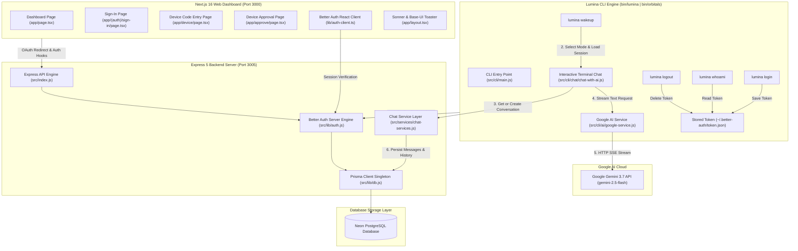
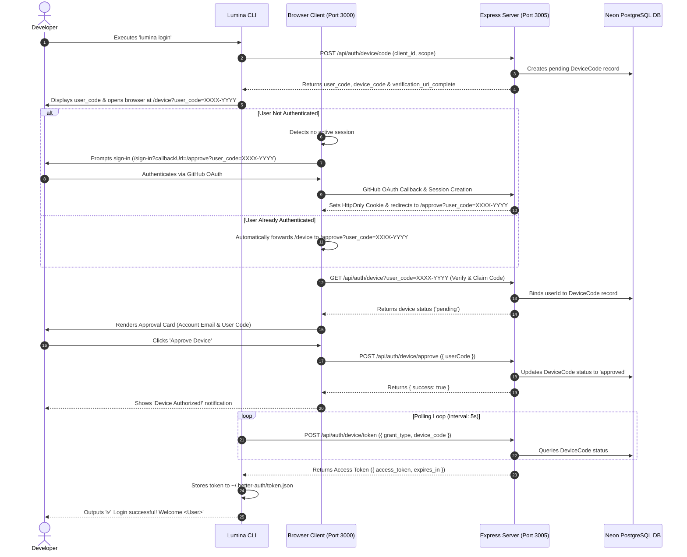
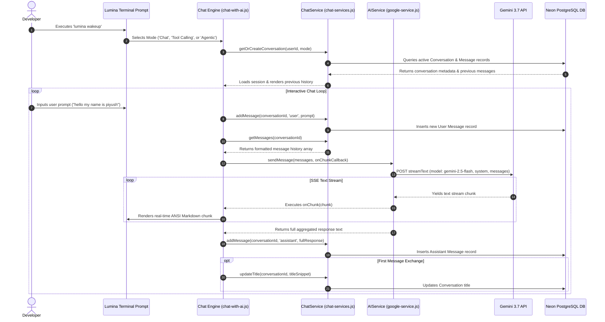
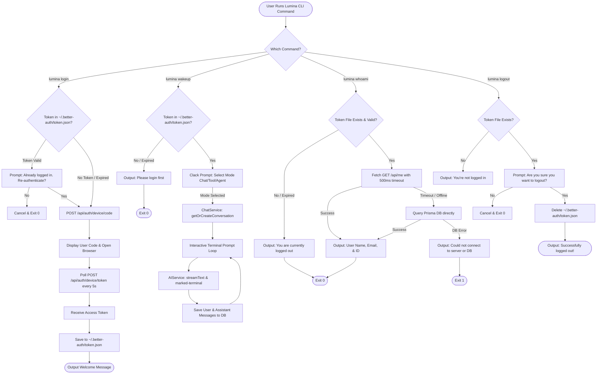
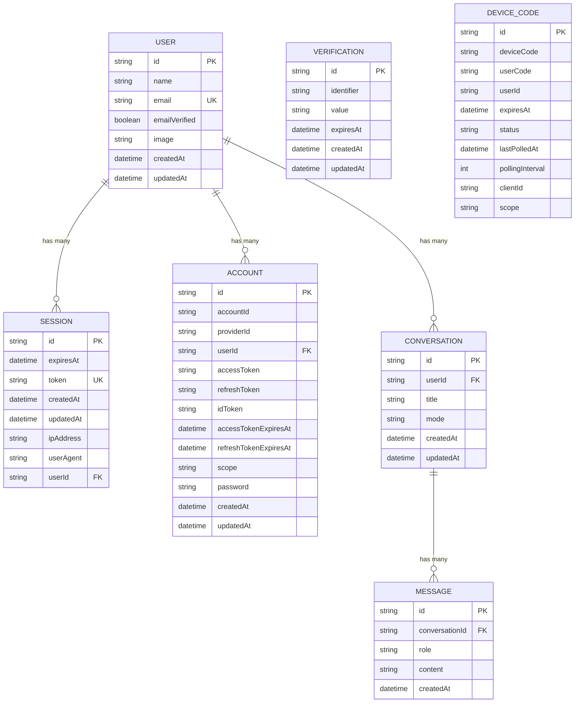

# ✨ Lumina & LuminaCLI — Autonomous AI Software Engineering Agent & Web Platform

<p align="center">
  <b>An Autonomous AI Software Engineering Agent that helps developers build, analyze, debug, and automate workflows directly from the terminal, paired with a Next.js 16 & Express 5 Web Platform.</b>
</p>

<p align="center">
  TypeScript • Node.js • Gemini AI (gemini-2.5-flash) • Vercel AI SDK • Next.js 16 • React 19 • Express.js 5 • Better Auth • Prisma ORM • PostgreSQL (Neon DB) • Tailwind CSS
</p>

---

## 📋 Table of Contents

- [🚀 Overview](#-overview)
- [🎯 Core Goals](#-core-goals)
- [✨ Features & Agent Capabilities](#-features--agent-capabilities)
- [🤖 Google Gemini 3.7 AI Engine & Persistent Chat Architecture](#-google-gemini-37-ai-engine--persistent-chat-architecture)
- [📊 Comprehensive Visual Architecture (Mermaid Flowcharts & Graphs)](#-comprehensive-visual-architecture-mermaid-flowcharts--graphs)
  - [1. Monorepo System Topology](#1-monorepo-system-topology)
  - [2. End-to-End CLI Device Authorization Sequence](#2-end-to-end-cli-device-authorization-sequence)
  - [3. Interactive AI Chat & Memory Streaming Sequence](#3-interactive-ai-chat--memory-streaming-sequence)
  - [4. CLI Command Execution Flowchart](#4-cli-command-execution-flowchart)
  - [5. Database Entity Relationship Diagram (ERD)](#5-database-entity-relationship-diagram-erd)
- [🏗️ Monorepo Structure & File Map](#️-monorepo-structure--file-map)
- [🛠️ Technology Stack](#️-technology-stack)
- [🔐 Authentication System Details](#-authentication-system-details)
- [🗄️ Database Schema Specification](#️-database-schema-specification)
- [💻 CLI Commands Reference](#-cli-commands-reference)
- [⚙️ Environment Variables Setup](#️-environment-variables-setup)
- [🛠️ Setup & Running Locally](#️-setup--running-locally)
- [📡 API Endpoints Reference](#-api-endpoints-reference)
- [🐛 Solved Edge Cases & Troubleshooting Guide](#-solved-edge-cases--troubleshooting-guide)
- [👨‍💻 Author & License](#-author--license)

---

## 🚀 Overview

**LuminaCLI** is an AI-powered command-line software engineering agent designed to act as an autonomous pair programmer. Powered by **Google Gemini 3.7 Flash** (`@ai-sdk/google`) and the Vercel AI SDK (`ai`), LuminaCLI can:

- Understand complex multi-file codebase contexts
- Conduct interactive, persistent multi-turn chat sessions (`lumina wakeup`)
- Stream real-time terminal responses formatted in rich ANSI Markdown (`marked` & `marked-terminal`)
- Store full chat session history and messages in PostgreSQL (`Conversation` & `Message` models)
- Plan technical implementations autonomously (`Plan` -> `Execute` -> `Test` -> `Verify`)
- Execute shell & terminal development commands safely
- Perform online web searches and documentation lookups
- Authenticate securely via GitHub OAuth 2.0 and OAuth Device Authorization Flow (RFC 8628)

It pairs a terminal-based CLI binary agent (`lumina` / `orbitals`) with a full-stack web application featuring an **Express 5** backend server (powered by **Better Auth** and **Prisma ORM** over PostgreSQL) and a modern **Next.js 16** frontend dashboard (utilizing **React 19**, **Tailwind CSS**, **Sonner**, and **Shadcn UI**).

---

## 🎯 Core Goals

- **Terminal-First Pair Programmer**: Analyze, debug, and edit code directly inside your terminal window.
- **Google Gemini 3.7 Powered Intelligence**: Utilize `gemini-2.5-flash` for ultra-fast, high-reasoning code generation and text streaming.
- **Database-Backed Conversation Memory**: Automatically persist chat sessions, titles, and message histories per user across sessions.
- **Multi-Mode Execution**: Support standard Chat, Tool Calling (search & code execution), and Agentic workflow modes.
- **Enterprise-Grade Security**: Secure CLI device authentication using standard OAuth 2.0 Device Code Authorization (RFC 8628).

---

## ✨ Features & Agent Capabilities

### 🤖 1. Interactive AI Assistant (`lumina wakeup`)
Command-line assistant powered by `AIService` (`server/src/cli/ai/google-service.js`) and `ChatService` (`server/src/services/chat-services.js`). Features interactive mode selection (`Chat`, `Tool Calling`, `Agentic Mode`), streaming text generation, and automatic ANSI terminal markdown rendering.

### 🧠 2. Persistent Chat History & Conversation Storage
Stores chat sessions in PostgreSQL. Automatically generates conversation titles from first messages, loads prior message context, and parses message objects.

### 🔧 3. Multi-Tool Calling Engine
Integrates web searching, code execution, git operations, and local filesystem manipulation directly from AI context.

### 🔐 4. OAuth Device Authorization (RFC 8628)
Enables headless terminal authentication via browser code verification (`/device` -> `/approve`).

### ⚡ 5. Fail-Fast & Quiet Environment Loading
Features 500ms abort timeouts for offline servers, silent `dotenv` configuration, and clean error handling cards powered by `boxen`.

---

## 🤖 Google Gemini 3.7 AI Engine & Persistent Chat Architecture

Lumina CLI uses Vercel AI SDK (`ai`) and Google provider (`@ai-sdk/google`) configured in [`server/src/config/google.config.js`](file:///d:/lumina/server/src/config/google.config.js) and [`server/src/cli/ai/google-service.js`](file:///d:/lumina/server/src/cli/ai/google-service.js):

### 1. Configuration (`server/src/config/google.config.js`)
```javascript
import dotenv from 'dotenv';
dotenv.config();

export const config = {
  googleApiKey: process.env.GOOGLE_GENERATIVE_AI_API_KEY || process.env.GOOGLE_API_KEY || '',
  model: process.env.LUMINA_MODEL || 'gemini-2.5-flash',
};
```

### 2. AI Service Implementation (`server/src/cli/ai/google-service.js`)
```javascript
import { google } from "@ai-sdk/google";
import { streamText } from "ai";
import { config } from "../../config/google.config.js";
import chalk from "chalk";

export class AIService {
  constructor() {
    if (!config.googleApiKey) {
      throw new Error("GOOGLE_GENERATIVE_AI_API_KEY is not set in environment variables");
    }
    
    this.model = google(config.model, {
      apiKey: config.googleApiKey,
    });
  }

  async sendMessage(messages, onChunk) {
    try {
      const streamConfig = {
        model: this.model,
        system: `You are Lumina CLI, an AI-powered Software Engineering Agent powered by Google Gemini (${config.model}). You help developers build, analyze, and debug software.`,
        messages: messages
      };

      const result = streamText(streamConfig);
      let fullResponse = "";
      
      for await (const chunk of result.textStream) {
        fullResponse += chunk;
        if (onChunk) onChunk(chunk);
      }

      const fullResult = await result;
      return {
        content: fullResponse,
        finishReason: fullResult.finishReason,
        usage: fullResult.usage,
      };
    } catch (error) {
      throw error;
    }
  }
}
```

---

## 📊 Comprehensive Visual Architecture (Mermaid Flowcharts & Graphs)

### 1. Monorepo System Topology

This diagram details the connection between the Lumina CLI terminal, AI streaming engine, persistent chat service layer, Next.js web application, Express 5 backend server, and Neon PostgreSQL cloud database.



---

### 2. End-to-End CLI Device Authorization Sequence

Sequence diagram showing terminal authentication via GitHub OAuth and RFC 8628 Device Authorization.



---

### 3. Interactive AI Chat & Memory Streaming Sequence

Sequence diagram detailing prompt execution, database conversation retrieval, streaming AI responses, ANSI terminal rendering, and message history storage.



---

### 4. CLI Command Execution Flowchart

Flowchart detailing how authentication commands (`login`, `whoami`, `logout`) and AI agent commands (`wakeup`) operate.



---

### 5. Database Entity Relationship Diagram (ERD)

Relational model showing PostgreSQL tables managed by Prisma ORM.



---

## 🏗️ Monorepo Structure & File Map

```text
lumina/
├── client/                             # Next.js 16 Frontend Web Application (Port 3000)
│   ├── app/                            # Next.js App Router
│   │   ├── (auth)/                     # Auth Route Group
│   │   │   └── sign-in/page.tsx        # GitHub Social Sign-In Page & callbackUrl Handler
│   │   ├── approve/page.tsx            # Device Authorization Review & Approval Page
│   │   ├── device/page.tsx             # Device Code Entry Page & Automatic Forwarder
│   │   ├── globals.css                 # CSS Design System Tokens & Utility Classes
│   │   ├── layout.tsx                  # Root Layout (ThemeProvider, Base-UI & Sonner Toasters)
│   │   └── page.tsx                    # Protected Dashboard Page
│   ├── components/                     # Reusable UI Components
│   │   ├── login-form.tsx              # GitHub Login Component
│   │   ├── theme-provider.tsx          # NextThemes Provider Configuration
│   │   └── ui/                         # Shadcn UI Components (Button, Card, Spinner, Toast, etc.)
│   ├── lib/                            # Frontend Utilities & Auth Client
│   │   ├── auth-client.ts              # Better Auth React Client (`better-auth/react`)
│   │   └── utils.ts                    # Class Merger (`clsx` + `tailwind-merge`)
│   └── package.json                    # Client Dependencies (`sonner`, `@base-ui/react`, Next 16)
│
├── server/                             # Express 5 Backend API Server & CLI Package (Port 3005)
│   ├── prisma/                         # Prisma Database Setup & Migrations
│   │   ├── migrations/                 # Migration SQL Files
│   │   └── schema.prisma               # Relational Schema Specification (User, Session, Conversation, Message)
│   ├── src/
│   │   ├── cli/                        # Lumina CLI Implementation
│   │   │   ├── ai/                     # AI Engine & Provider Services
│   │   │   │   └── google-service.js   # Gemini 3.7 AI Service (`streamText`, System Prompts)
│   │   │   ├── chat/                   # CLI Terminal Interactive Chat Handlers
│   │   │   │   ├── chat-with-ai.js     # Interactive Terminal Chat Loop & Markdown Renderer
│   │   │   │   ├── chat-with-ai-tool.js# Tool Calling Chat Mode Handler
│   │   │   │   └── chat-with-ai-agent.js# Agentic AI Mode Handler
│   │   │   ├── commands/
│   │   │   │   ├── ai/
│   │   │   │   │   └── wakeUp.js       # 'lumina wakeup' Command & Options Prompts
│   │   │   │   └── auth/
│   │   │   │       └── login.js        # 'lumina login', 'whoami', & 'logout' Handlers
│   │   │   └── main.js                 # CLI Binary Entry Point (`lumina` / `orbitals`)
│   │   ├── config/                     # Server Configurations
│   │   │   └── google.config.js        # Google Generative AI Model & Key Config
│   │   ├── lib/                        # Shared Server Libraries
│   │   │   ├── auth.js                 # Better Auth Server Engine & Device Flow Plugin
│   │   │   ├── db.js                   # Prisma Client Singleton & Postgres Connection Pool
│   │   │   └── token.js                # Local Token File Utilities (~/.better-auth/token.json)
│   │   ├── services/                   # Server Data Services
│   │   │   └── chat-services.js        # Conversation & Message Database Persistence Layer
│   │   └── index.js                    # Express Application Entry Point (/api/auth/*, /api/me)
│   ├── .env                            # Backend Server Environment Variables
│   └── package.json                    # Server Dependencies (`@ai-sdk/google`, `ai`, `marked`, `marked-terminal`)
│
└── README.md                           # Master Architecture Documentation
```

---

## 🛠️ Technology Stack

### Frontend (`client/`)
| Technology | Version | Purpose |
| :--- | :--- | :--- |
| **Next.js** | `16.3.0` | App Router React Framework |
| **React** | `19.2.8` | UI Rendering Engine |
| **Tailwind CSS** | `4.x` | Utility-First Styling Framework |
| **Sonner** | `2.0.8` | Toast Notification System |
| **Better Auth Client** | `1.6.27` | React Auth Hooks (`better-auth/react`) |
| **Lucide React** | `1.29.0` | Vector UI Icons |

### Backend & CLI (`server/`)
| Technology | Version | Purpose |
| :--- | :--- | :--- |
| **Node.js** | `>= 18.x` | JavaScript Runtime (ES Modules) |
| **Google Gemini AI** | `@ai-sdk/google` | Generative AI Provider (`gemini-2.5-flash`) |
| **Vercel AI SDK** | `ai` | AI Text Streaming & Structured Object Generation |
| **Marked & Terminal** | `15.x` / `7.x` | Terminal ANSI Markdown Rendering |
| **Express** | `5.2.1` | HTTP Server & Web API Routing |
| **Better Auth Server** | `1.6.27` | Auth Engine & Device Authorization Plugin |
| **Prisma ORM** | `7.9.1` | Database ORM & Migrations |
| **PostgreSQL** | `Neon DB` | Cloud Serverless Database |
| **Commander.js** | `15.0.0` | CLI Command Router |
| **Clack Prompts** | `1.7.0` | Interactive CLI Prompts & Confirmations |
| **Chalk & Boxen** | Latest | Terminal Banners, Boxes & Colored Output |

---

## 🔐 Authentication System Details

### 1. GitHub Social OAuth 2.0
- Initiated via `authClient.signIn.social({ provider: "github", callbackURL: targetCallback })`.
- Better Auth handles OAuth authorization exchange with GitHub API.
- Automatically generates and stores user session records in PostgreSQL `session` table and issues HttpOnly session cookies.

### 2. OAuth Device Authorization (RFC 8628)
- Configured in `server/src/lib/auth.js`:
  ```javascript
  plugins: [
    deviceAuthorization({ 
      verificationUri: "http://localhost:3000/device", 
    }), 
  ]
  ```
- Exposes device endpoints:
  - `POST /api/auth/device/code`: Generates `user_code` (e.g. `ZBVDU99D`) and `device_code`.
  - `GET /api/auth/device?user_code=...`: Verifies code and **claims `userId`** for active session.
  - `POST /api/auth/device/approve`: Sets status to `"approved"`.
  - `POST /api/auth/device/deny`: Sets status to `"denied"`.
  - `POST /api/auth/device/token`: Polls status and returns access token upon approval.

---

## 🗄️ Database Schema Specification

Below is the complete database schema defined in [`server/prisma/schema.prisma`](file:///d:/lumina/server/prisma/schema.prisma):

```prisma
datasource db {
  provider = "postgresql"
  url      = env("DATABASE_URL")
}

generator client {
  provider = "prisma-client-js"
}

model User {
  id            String         @id
  name          String
  email         String
  emailVerified Boolean        @default(false)
  image         String?
  createdAt     DateTime       @default(now())
  updatedAt     DateTime       @updatedAt
  sessions      Session[]
  accounts      Account[]
  conversations Conversation[]

  @@unique([email])
  @@map("user")
}

model Session {
  id        String   @id
  expiresAt DateTime
  token     String   @unique
  createdAt DateTime @default(now())
  updatedAt DateTime @updatedAt
  ipAddress String?
  userAgent String?
  userId    String
  user      User     @relation(fields: [userId], references: [id], onDelete: Cascade)

  @@index([userId])
  @@map("session")
}

model Account {
  id                    String    @id
  accountId             String
  providerId            String
  userId                String
  user                  User      @relation(fields: [userId], references: [id], onDelete: Cascade)
  accessToken           String?
  refreshToken          String?
  idToken               String?
  accessTokenExpiresAt  DateTime?
  refreshTokenExpiresAt DateTime?
  scope                 String?
  password              String?
  createdAt             DateTime  @default(now())
  updatedAt             DateTime  @updatedAt

  @@index([userId])
  @@map("account")
}

model Verification {
  id         String   @id
  identifier String
  value      String
  expiresAt  DateTime
  createdAt  DateTime @default(now())
  updatedAt  DateTime @updatedAt

  @@index([identifier])
  @@map("verification")
}

model DeviceCode {
  id              String    @id
  deviceCode      String
  userCode        String
  userId          String?
  expiresAt       DateTime
  status          String
  lastPolledAt    DateTime?
  pollingInterval Int?
  clientId        String?
  scope           String?

  @@map("deviceCode")
}

model Conversation {
  id        String    @id @default(cuid())
  userId    String
  title     String?
  mode      String    @default("chat")
  createdAt DateTime  @default(now())
  updatedAt DateTime  @updatedAt

  user     User       @relation(fields: [userId], references: [id], onDelete: Cascade)
  messages Message[]

  @@map("conversation")
}

model Message {
  id             String       @id @default(cuid())
  conversationId String
  role           String
  content        String
  createdAt      DateTime     @default(now())

  conversation Conversation @relation(fields: [conversationId], references: [id], onDelete: Cascade)

  @@index([conversationId])
  @@map("message")
}
```

---

## 💻 CLI Commands Reference

You can run `lumina` or `orbitals` commands from any terminal once linked (`npm link` inside `server/`).

### 1. `lumina wakeup`
Launches the interactive AI Pair Programming session with mode choice (`Chat`, `Tool Calling`, `Agentic Mode`).
```bash
lumina wakeup
```

### 2. `lumina login`
Initiates device authorization flow, displays user code, opens browser, and polls for token authorization.
```bash
lumina login
```

### 3. `lumina whoami`
Displays current authenticated user details (Name, Email, ID). Works smoothly when logged in or logged out.
```bash
lumina whoami
```

### 4. `lumina logout`
Prompts confirmation and clears local credentials from `~/.better-auth/token.json`.
```bash
lumina logout
```

---

## ⚙️ Environment Variables Setup

Create a `.env` file in the `server/` directory (`server/.env`):

```env
PORT=3005

# PostgreSQL Database Connection Strings (Neon DB with verify-full SSL mode)
DATABASE_URL="postgresql://neondb_owner:<password>@<host>/neondb?sslmode=verify-full&channel_binding=require"
DIRECT_URL="postgresql://neondb_owner:<password>@<host>/neondb?sslmode=verify-full"

# Better Auth Secret & Public URL
BETTER_AUTH_SECRET=your_generated_secret_key_here
BETTER_AUTH_URL=http://localhost:3005

# GitHub OAuth App Credentials
GITHUB_CLIENT_ID=your_github_client_id
GITHUB_CLIENT_SECRET=your_github_client_secret

# Google Gemini AI Config
GOOGLE_GENERATIVE_AI_API_KEY=your_google_ai_api_key_here
LUMINA_MODEL=gemini-2.5-flash
```

---

## 🛠️ Setup & Running Locally

### 1. Install Monorepo Dependencies
```bash
cd server && npm install
cd ../client && npm install
```

### 2. Link CLI Binary (Global Command)
```bash
cd server
npm link
```

### 3. Push Database Schema
```bash
cd server
npx prisma db push
```

### 4. Start Backend Server
```bash
cd server
npm run dev
```
*Listens at `http://localhost:3005`.*

### 5. Start Next.js Frontend
```bash
cd client
npm run dev
```
*Listens at `http://localhost:3000`.*

---

## 📡 API Endpoints Reference

| Method | Endpoint | Description |
| :--- | :--- | :--- |
| `GET` | `/health` | Server health check (`OK`) |
| `GET` | `/api/me` | Fetch active user session |
| `POST` | `/api/auth/sign-in/social` | Initiate OAuth flow (`github`) |
| `GET` | `/api/auth/device?user_code=...` | Verify & claim device authorization code |
| `POST` | `/api/auth/device/approve` | Approve device code authorization |
| `POST` | `/api/auth/device/deny` | Deny device code authorization |
| `POST` | `/api/auth/device/token` | Poll device token issuance |
| `ALL` | `/api/auth/*` | Better Auth endpoint handler |

---

## 🐛 Solved Edge Cases & Troubleshooting Guide

### 1. `Prisma Schema Validation Error (Relation Mismatch)`
- **Fix**: Added back-relation `conversations Conversation[]` array to `User` model to match `user User @relation(fields: [userId], references: [id], onDelete: Cascade)` in `Conversation`.

### 2. Google AI Model 404 Deprecation Error
- **Fix**: Google AI Studio retired legacy endpoints (`gemini-2.5-flash` / `gemini-2.0-flash`). Updated model identifier to **`gemini-2.5-flash`** across environment variables and config fallbacks.

### 3. Missing `marked` Module in Terminal Chat
- **Fix**: Installed `marked` package alongside `marked-terminal` in `server/package.json` for rich ANSI code blocks and Markdown formatting.

### 4. Missing `chat-with-ai-tool.js` Module Error
- **Fix**: Implemented `startToolChat` and `startAgentChat` handler modules in `server/src/cli/chat/` so `wakeUp.js` resolves all mode selections without `ERR_MODULE_NOT_FOUND`.

### 5. Slow CLI Terminal Response (~5 Seconds)
- **Fix**: Added `signal: AbortSignal.timeout(500)` to API fetches and explicit `process.exit(0)` to close Prisma background database socket connections instantly.

### 6. Command Execution Outside Server Folder (`.env` not found)
- **Fix**: Updated `db.js`, `main.js`, `wakeUp.js`, and `login.js` to resolve `.env` path using `path.resolve(__dirname, "../../../.env")` relative to script file locations.

---

## 👨‍💻 Author & License

**Piyush Kumar**  
B.Tech Student @ IIITDM Jabalpur  
GitHub: [@piyushkumariiitj](https://github.com/piyushkumariiitj)

Distributed under the [MIT License](LICENSE).
