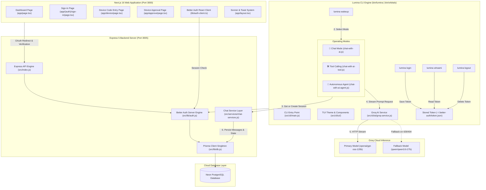
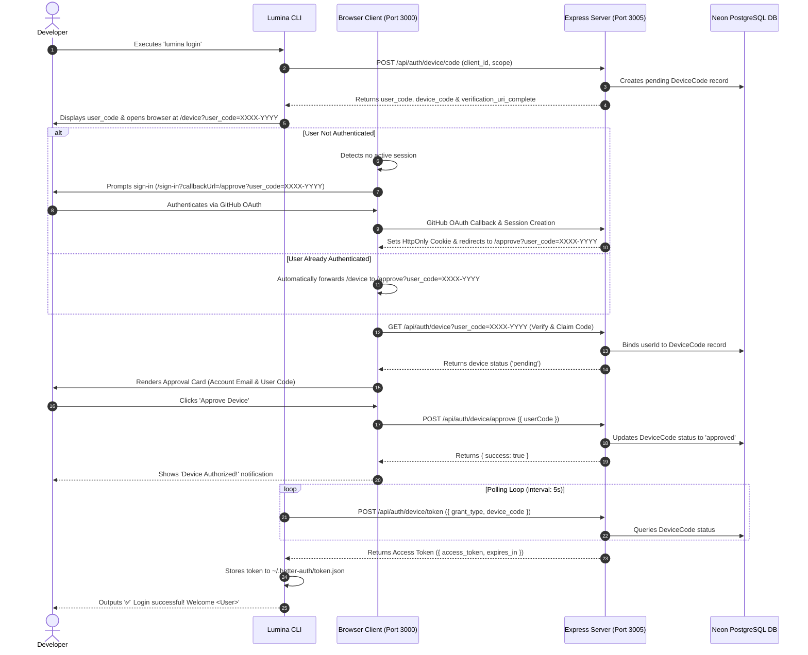
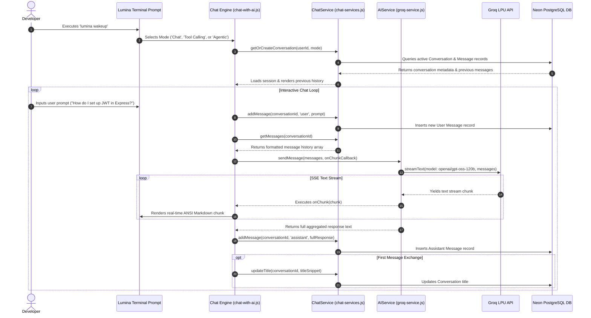
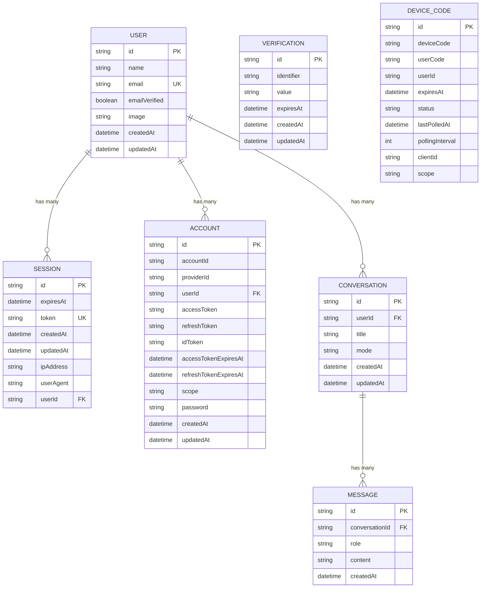

# ✨ Lumina & LuminaCLI — Autonomous AI Software Engineering Agent & Web Platform

<p align="center">
  <b>An Autonomous AI Software Engineering Agent that helps developers build, analyze, debug, and architect workflows directly from the terminal, paired with a Next.js 16 & Express 5 Web Platform.</b>
</p>

<p align="center">
  
  
  
  
  
  
  
  
  
  
</p>

---

## 📋 Table of Contents

- [🚀 Overview](#-overview)
- [🎯 Core Capabilities](#-core-capabilities)
- [🕹️ Three Powerful Operating Modes](#️-three-powerful-operating-modes)
  - [1. 💬 Chat Mode (Persistent Memory)](#1--chat-mode-persistent-memory)
  - [2. 🛠️ Tool Calling Mode (Real-Time Developer Tools)](#2-️-tool-calling-mode-real-time-developer-tools)
  - [3. 🤖 Autonomous Agent Mode (Project Architect & Generator)](#3--autonomous-agent-mode-project-architect--generator)
- [🎨 Terminal User Interface (TUI) & Design System](#-terminal-user-interface-tui--design-system)
- [⚡ Groq AI Engine & Multi-Model Resilience](#-groq-ai-engine--multi-model-resilience)
- [📊 Comprehensive Visual Architecture](#-comprehensive-visual-architecture)
  - [1. Monorepo System Topology](#1-monorepo-system-topology)
  - [2. End-to-End RFC 8628 Device Authorization Flow](#2-end-to-end-rfc-8628-device-authorization-flow)
  - [3. Interactive AI Chat & Memory Streaming Sequence](#3-interactive-ai-chat--memory-streaming-sequence)
  - [4. CLI Command Execution Flowchart](#4-cli-command-execution-flowchart)
  - [5. Database Entity Relationship Diagram (ERD)](#5-database-entity-relationship-diagram-erd)
- [🏗️ Monorepo Structure & File Map](#️-monorepo-structure--file-map)
- [🛠️ Technology Stack](#️-technology-stack)
- [🔐 Authentication System Details](#-authentication-system-details)
- [🧰 Built-in Developer Tools Reference](#-built-in-developer-tools-reference)
- [🗄️ Database Schema Specification](#️-database-schema-specification)
- [💻 CLI Commands Reference](#-cli-commands-reference)
- [⚙️ Environment Variables Setup](#️-environment-variables-setup)
- [🛠️ Setup & Running Locally](#️-setup--running-locally)
- [📡 API Endpoints Reference](#-api-endpoints-reference)
- [🐛 Solved Edge Cases & Troubleshooting Guide](#-solved-edge-cases--troubleshooting-guide)
- [👨‍💻 Author & License](#-author--license)

---

## 🚀 Overview

**Lumina & LuminaCLI** is a production-ready, autonomous AI-powered command-line software engineering companion paired with a full-stack Next.js web application. Powered by **Groq LPU Inference Engine** (`@ai-sdk/groq`) and the **Vercel AI SDK** (`ai`), Lumina brings ultra-fast reasoning, codebase analysis, live tool execution, and end-to-end full-stack app scaffolding straight to your terminal.

Whether you need an interactive pair programmer that remembers prior context across sessions, an intelligent assistant equipped with live web search and sandboxed code execution, or an autonomous agent capable of generating production-ready multi-file projects from a single prompt, Lumina handles it seamlessly.

### What Makes Lumina Unique?
- **Ultra-Fast Streaming**: Powered by Groq models (`openai/gpt-oss-120b`, `qwen/qwen3.6-27b`) delivering instant token output.
- **Persistent Database Memory**: Every conversation, title, role, and message is automatically persisted to Neon PostgreSQL via Prisma ORM.
- **Stunning Terminal Aesthetics**: Cyberpunk & Neon gradient banners, glowing pill badges, ANSI Markdown code blocks, and animated spinners.
- **Enterprise-Grade RFC 8628 Auth**: Device Authorization flow allowing headless terminal logins approved through the web portal via GitHub OAuth 2.0.
- **Autonomous Scaffolder**: Generates directory hierarchies, writes code files to disk, and prints copy-pasteable launch commands.

---

## 🎯 Core Capabilities

| Capability | Description |
| :--- | :--- |
| 💬 **Persistent Conversational AI** | Multi-turn reasoning with automatic session recovery, title generation, and rich markdown rendering. |
| 🛠️ **Real-Time Tool Invocation** | Live web searching, JS/Python code execution, math evaluation, file inspection, and git status analysis. |
| 🤖 **Autonomous Fullstack Agent** | Scaffolds complete multi-file applications with automatic disk writes, directory creation, and setup scripts. |
| 🔐 **RFC 8628 Device Authorization** | Secure headless CLI authorization with browser verification codes and instant polling backoff. |
| ⚡ **Resilient AI Pipeline** | Automatic fallback model routing, rate limit (429) backoff handling, and silent `.env` resolution. |
| 🎨 **Bespoke Terminal UI** | ANSI shadow typography, curated multi-color gradient palettes, custom pill tags, and structured boxen cards. |

---

## 🕹️ Three Powerful Operating Modes

Launch the interactive launcher at any time via:
```bash
lumina wakeup
```

```text
✦ Lumina CLI v1.0.0 • openai/gpt-oss-120b

  ✦ Developer <local@lumina>
  • Engine: openai/gpt-oss-120b  • Status: Active

? Select capability:
  ❯ 💬 Chat                  (Conversational AI with memory and code formatting)
    ⚡ Tools                 (Live web search, code execution, git, workspace reader)
    🤖 Agent                 (Autonomous project architect & code generator)
    ⚙  Status & Diagnostics  (Inspect profile, Groq model, and database connection)
    🚪 Exit
```

---

### 1. 💬 Chat Mode (Persistent Memory)
- **Interactive Multi-Turn Conversation**: Talk with Lumina about software architecture, algorithms, debugging, or code review.
- **PostgreSQL Database Storage**: Conversations and messages are persisted in PostgreSQL (`Conversation` & `Message` models) and restored on next launch.
- **Real-Time ANSI Markdown**: Headers, code blocks, syntax styling, bullet points, and tables.
- **In-Chat Commands**:
  - `/clear` — Clear the terminal screen while keeping memory intact.
  - `exit` or `quit` — Gracefully terminate the session.

---

### 2. 🛠️ Tool Calling Mode (Real-Time Developer Tools)
Arm Lumina with specific developer tools via interactive multi-select:

```text
? Select tools to enable:
  [✔] Web & Google Search            (Search the live web for docs and error fixes)
  [✔] Code Execution & Problem Solver (Safely execute JS or Python code snippets)
  [✔] Calculator & Math Engine       (Evaluate mathematical formulas and algebra)
  [✔] Workspace File Reader          (Read project source files and configs)
  [✔] Git Repository Inspector       (Inspect status, branches, commits, diffs)
  [✔] Web URL Reader                 (Fetch and analyze content from public URLs)
  [✔] System Diagnostics             (Inspect OS, Node version, memory, uptime)
```

- **Human-Friendly Status Indicators**: Instead of raw JSON dumps, Lumina displays real-time execution indicators:
  ```text
  ⚡ Searching the web for: "physical reporting date for first year in iiitdmj"
  ✔ Found 5 sources
  ```
- **Natural Language AI Synthesis**: Tools automatically pass live data to Groq models for direct, natural language analysis and answers.

---

### 3. 🤖 Autonomous Agent Mode (Project Architect & Generator)
Give Lumina a high-level application idea (e.g., *"Build a REST API with Express, JWT auth, and Prisma"* or *"Create a modern React portfolio with Tailwind"*):

1. **Structured Schema Validation**: Uses Vercel AI SDK `generateObject` with Zod schema (`ApplicationSchema`).
2. **Architecture Summary**: Single-line summary of generated project name, description, and file count.
3. **File Tree Display**: Visual directory tree with syntax-specific file icons (`📦`, `⚛️`, `🟨`, `🐍`, `🎨`, `📝`).
4. **Direct Disk I/O**: Automatically creates the directory tree and writes complete, un-truncated files to your working directory.
5. **Next Steps Box**: Outputs runnable commands (`cd app-name && npm install && npm run dev`).

---

## 🎨 Terminal User Interface (TUI) & Design System

Lumina features a bespoke, minimalist terminal design system located in [`server/src/cli/ui/`](file:///d:/lumina/server/src/cli/ui/):

### Color System & Semantic Roles

| Role | Color | Hex | Purpose |
| :--- | :--- | :--- | :--- |
| **`accent`** | Amber | `#e8b339` | Brand / header glyph (`✦`) — warm, draws the eye once |
| **`user`** | Green | `#5fd75f` | User input / prompt — calm, recedes once read |
| **`agent`** | Violet | `#af87ff` | Distinct from user green, reads as "other speaker" |
| **`tool`** | Steel Blue | `#5fafd7` | Tool names and execution tags — cool, non-conversational |
| **`tool.dim`**| Grey | `#6c6c6c` | Tool output body — de-emphasized vs command line |
| **`success`** | Mint Green | `#5fd787` | Tool succeeded / good exit code / active status |
| **`error`** | Coral Red | `#ff5f5f` | Failures, exceptions, connection errors |
| **`warning`** | Orange | `#ffaf5f` | Rate limits, warnings, fallback notices |
| **`muted`** | Grey | `#808080` | Footers, hints, shortcuts, timestamps |
| **`border`** | Dark Grey | `#3a3a3a` | Panel borders — visible but recedes |

### UI Modules
- **`theme.js`**: Semantic color tokens and symbols mapped directly to the palette specification.
- **`components.js`**: Header banner, clean user cards, session headers, tool execution indicators, file tree visualizer, and setup command formatters.
- **`markdown.js`**: Tailored `marked` + `marked-terminal` integration with clean indentation, syntax highlights, citation cleanup, and **smart table-to-bullet-list conversion** preventing broken ASCII grids across varying terminal window widths.

---

## ⚡ Groq AI Engine & Multi-Model Resilience

Lumina CLI leverages Groq's high-speed inference engine configured in [`server/src/config/groq.config.js`](file:///d:/lumina/server/src/config/groq.config.js) and [`server/src/cli/ai/groq-service.js`](file:///d:/lumina/server/src/cli/ai/groq-service.js):

### 1. Configuration
```javascript
export const config = {
  groqApiKey: process.env.GROQ_API_KEY || process.env.GROQ_KEY || '',
  model: process.env.LUMINA_MODEL || 'openai/gpt-oss-120b',
  fallbackModel: process.env.LUMINA_FALLBACK_MODEL || 'qwen/qwen3.6-27b',
};
```

### 2. Multi-Tier Error & Fallback Handling
- **Rate Limit / Decommissioning Auto-Fallback**: If the primary model hits a rate limit (429) or is unavailable (404), the `AIService` automatically falls back to `qwen/qwen3.6-27b` without dropping the user's prompt.
- **Reasoning Configuration**: Configured with `reasoningFormat: "hidden"` and `reasoningEffort: "low"` for maximum throughput.
- **Empty Stream Guard**: Detects tool-only executions and synthesizes clean structured markdown from tool outputs.

---

## 📊 Comprehensive Visual Architecture

### 1. Monorepo System Topology



---

### 2. End-to-End RFC 8628 Device Authorization Flow



---

### 3. Interactive AI Chat & Memory Streaming Sequence



---

### 4. CLI Command Execution Flowchart


---

### 5. Database Entity Relationship Diagram (ERD)



---

## 🏗️ Monorepo Structure & File Map

```text
lumina/
├── client/                             # Next.js 16 Frontend Web Application (Port 3000)
│   ├── app/                            # Next.js App Router
│   │   ├── (auth)/                     # Auth Route Group
│   │   │   └── sign-in/page.tsx        # GitHub Social Sign-In Page & callbackUrl Handler
│   │   ├── approve/page.tsx            # Device Authorization Review & Approval Page
│   │   ├── device/page.tsx             # Device Code Entry Page & Automatic Forwarder
│   │   ├── globals.css                 # CSS Design System Tokens & Utility Classes
│   │   ├── layout.tsx                  # Root Layout (ThemeProvider, Base-UI & Sonner Toasters)
│   │   └── page.tsx                    # Protected Developer Dashboard Page
│   ├── components/                     # Reusable UI Components
│   │   ├── login-form.tsx              # GitHub Login Component
│   │   ├── theme-provider.tsx          # NextThemes Provider Configuration
│   │   └── ui/                         # Shadcn UI Components (Button, Card, Spinner, Toast, etc.)
│   ├── lib/                            # Frontend Utilities & Auth Client
│   │   ├── auth-client.ts              # Better Auth React Client (`better-auth/react`)
│   │   └── utils.ts                    # Class Merger (`clsx` + `tailwind-merge`)
│   └── package.json                    # Client Dependencies (`sonner`, `@base-ui/react`, Next 16)
│
├── server/                             # Express 5 Backend API Server & CLI Package (Port 3005)
│   ├── prisma/                         # Prisma Database Setup & Migrations
│   │   ├── migrations/                 # Migration SQL Files
│   │   └── schema.prisma               # Relational Schema (User, Session, Conversation, Message)
│   ├── src/
│   │   ├── cli/                        # Lumina CLI Core Implementation
│   │   │   ├── ai/                     # AI Engine & Provider Services
│   │   │   │   └── groq-service.js     # Groq AI Service (`streamText`, Fallback, Error Handling)
│   │   │   ├── chat/                   # CLI Interactive Chat Handlers
│   │   │   │   ├── chat-with-ai.js     # Mode 1: Interactive Chat Loop & Markdown Streamer
│   │   │   │   ├── chat-with-ai-tool.js# Mode 2: Real-Time Tool Calling Loop & Cards
│   │   │   │   └── chat-with-ai-agent.js# Mode 3: Autonomous Fullstack Project Generator
│   │   │   ├── commands/
│   │   │   │   ├── ai/
│   │   │   │   │   └── wakeUp.js       # 'lumina wakeup' Interactive Capability Selector
│   │   │   │   └── auth/
│   │   │   │       └── login.js        # 'lumina login', 'whoami', & 'logout' Handlers
│   │   │   ├── ui/                     # Terminal User Interface (TUI) Design System
│   │   │   │   ├── components.js       # Banners, User Cards, Tool Boxes, File Trees, Setup Cmds
│   │   │   │   ├── markdown.js         # Custom ANSI Terminal Markdown Parser
│   │   │   │   └── theme.js            # Curated Gradients, Color Tokens, Symbols, Badges & Tags
│   │   │   └── main.js                 # CLI Binary Entry Point (`lumina` / `orbitals`)
│   │   ├── config/                     # Configuration Modules
│   │   │   ├── agent.config.js         # Autonomous Agent Zod Schema & File Writer Engine
│   │   │   ├── groq.config.js          # Groq API Keys, Primary & Fallback Model Settings
│   │   │   └── tool.config.js          # 7 Universal Developer AI Tools & Execution Handlers
│   │   ├── lib/                        # Shared Server Libraries
│   │   │   ├── auth.js                 # Better Auth Server Engine & Device Flow Plugin
│   │   │   ├── db.js                   # Prisma Client Singleton & Postgres Connection Pool
│   │   │   └── token.js                # Local Token File Utilities (~/.better-auth/token.json)
│   │   ├── services/                   # Server Data Services
│   │   │   └── chat-services.js        # Conversation & Message Database Persistence Layer
│   │   └── index.js                    # Express Application Entry Point (/api/auth/*, /api/me)
│   ├── .env                            # Backend Server Environment Variables
│   └── package.json                    # Server Dependencies (`@ai-sdk/groq`, `ai`, `better-auth`, etc.)
│
└── README.md                           # Master Architecture & User Documentation
```

---

## 🛠️ Technology Stack

### Frontend Web App (`client/`)
| Technology | Version | Purpose |
| :--- | :--- | :--- |
| **Next.js** | `16.3.0` | App Router React Framework |
| **React** | `19.2.8` | UI Rendering Engine |
| **Tailwind CSS** | `4.x` | Utility-First Styling Framework |
| **Sonner** | `2.0.8` | Toast Notification System |
| **Better Auth Client** | `1.6.27` | React Auth Hooks (`better-auth/react`) |
| **Lucide React** | `1.29.0` | Modern Vector UI Icons |

### Backend Server & CLI Binary (`server/`)
| Technology | Version | Purpose |
| :--- | :--- | :--- |
| **Node.js** | `>= 18.x` | JavaScript Runtime (ES Modules) |
| **Groq AI Engine** | `@ai-sdk/groq` | Ultra-Fast LPU LLM Provider (`openai/gpt-oss-120b`) |
| **Vercel AI SDK** | `ai` (`v7.x`) | AI Text Streaming, Tools, & Structured Object Generation |
| **Express.js** | `5.2.1` | HTTP Server & Web API Routing |
| **Better Auth Server** | `1.6.27` | OAuth Engine & RFC 8628 Device Authorization Plugin |
| **Prisma ORM** | `7.9.1` | Database ORM, Migrations, & Postgres Adapter |
| **PostgreSQL** | `Neon DB` | Serverless Cloud PostgreSQL Database |
| **Commander.js** | `15.0.0` | CLI Command Routing & Option Parsing |
| **Clack Prompts** | `1.7.0` | Interactive Terminal Prompts, Multi-selects, & Spinners |
| **Chalk & Boxen** | `6.x` / `8.x` | Terminal Styling, Borders, Pill Badges & Boxes |
| **Figlet** | `1.11.4` | ASCII Art Typography |
| **Marked & Terminal** | `18.x` / `7.x` | Terminal ANSI Markdown Rendering |
| **Zod** | `4.x` | Type Safety & Structured Output Schemas |

---

## 🔐 Authentication System Details

### 1. GitHub Social OAuth 2.0
- Initiated via `authClient.signIn.social({ provider: "github", callbackURL: targetCallback })`.
- Better Auth handles OAuth authorization exchange with GitHub API.
- Automatically generates and stores user session records in PostgreSQL `session` table and issues HttpOnly session cookies.

### 2. OAuth Device Authorization (RFC 8628)
- Configured in [`server/src/lib/auth.js`](file:///d:/lumina/server/src/lib/auth.js):
  ```javascript
  plugins: [
    deviceAuthorization({ 
      verificationUri: "http://localhost:3000/device", 
    }), 
  ]
  ```
- Exposes device endpoints:
  - `POST /api/auth/device/code`: Generates `user_code` (e.g. `XXXX-YYYY`) and `device_code`.
  - `GET /api/auth/device?user_code=...`: Verifies code and **claims `userId`** for active session.
  - `POST /api/auth/device/approve`: Sets status to `"approved"`.
  - `POST /api/auth/device/deny`: Sets status to `"denied"`.
  - `POST /api/auth/device/token`: Polls status and returns access token upon approval.

---

## 🧰 Built-in Developer Tools Reference

In **Tool Calling Mode**, Lumina can execute 7 universal developer tools defined in [`server/src/config/tool.config.js`](file:///d:/lumina/server/src/config/tool.config.js):

| Tool ID | Tool Name | Description | Example Query |
| :--- | :--- | :--- | :--- |
| `web_search` | **Web & Google Search** | Search the live internet for documentation, package releases, and technical solutions. | *"What is the latest syntax for Better Auth device authorization?"* |
| `code_execution` | **Code Execution** | Safely runs JavaScript (`node`) or Python (`python`) code and captures output/errors. | *"Test this regex against these 5 email patterns in JS"* |
| `calculator` | **Math Engine** | Evaluates mathematical formulas, trigonometric equations, and algebraic expressions. | *"Calculate Math.sqrt(1024) * 45 / 3.14"* |
| `workspace_reader` | **Workspace File Reader** | Reads project source files, `package.json`, or configuration files in the current folder. | *"Read package.json and tell me what dependencies need updates"* |
| `git_inspector` | **Git Repository Inspector** | Runs git status, commit history, current branch, or uncommitted diff analysis. | *"Check my uncommitted git diff and summarize changes"* |
| `fetch_url` | **Web URL Reader** | Fetches raw content or JSON data from any public HTTP/HTTPS URL. | *"Fetch https://api.github.com/zen and display it"* |
| `system_info` | **System Diagnostics** | Inspects local developer OS, platform, Node version, and directory path. | *"What Node version and architecture am I running on?"* |

---

## 🗄️ Database Schema Specification

Below is the complete database schema defined in [`server/prisma/schema.prisma`](file:///d:/lumina/server/prisma/schema.prisma):

```prisma
datasource db {
  provider = "postgresql"
  url      = env("DATABASE_URL")
}

generator client {
  provider = "prisma-client-js"
}

model User {
  id            String         @id
  name          String
  email         String
  emailVerified Boolean        @default(false)
  image         String?
  createdAt     DateTime       @default(now())
  updatedAt     DateTime       @updatedAt
  sessions      Session[]
  accounts      Account[]
  conversations Conversation[]

  @@unique([email])
  @@map("user")
}

model Session {
  id        String   @id
  expiresAt DateTime
  token     String   @unique
  createdAt DateTime @default(now())
  updatedAt DateTime @updatedAt
  ipAddress String?
  userAgent String?
  userId    String
  user      User     @relation(fields: [userId], references: [id], onDelete: Cascade)

  @@index([userId])
  @@map("session")
}

model Account {
  id                    String    @id
  accountId             String
  providerId            String
  userId                String
  user                  User      @relation(fields: [userId], references: [id], onDelete: Cascade)
  accessToken           String?
  refreshToken          String?
  idToken               String?
  accessTokenExpiresAt  DateTime?
  refreshTokenExpiresAt DateTime?
  scope                 String?
  password              String?
  createdAt             DateTime  @default(now())
  updatedAt             DateTime  @updatedAt

  @@index([userId])
  @@map("account")
}

model Verification {
  id         String   @id
  identifier String
  value      String
  expiresAt  DateTime
  createdAt  DateTime @default(now())
  updatedAt  DateTime @updatedAt

  @@index([identifier])
  @@map("verification")
}

model DeviceCode {
  id              String    @id
  deviceCode      String
  userCode        String
  userId          String?
  expiresAt       DateTime
  status          String
  lastPolledAt    DateTime?
  pollingInterval Int?
  clientId        String?
  scope           String?

  @@map("deviceCode")
}

model Conversation {
  id        String    @id @default(cuid())
  userId    String
  title     String?
  mode      String    @default("chat")
  createdAt DateTime  @default(now())
  updatedAt DateTime  @updatedAt

  user     User       @relation(fields: [userId], references: [id], onDelete: Cascade)
  messages Message[]

  @@map("conversation")
}

model Message {
  id             String       @id @default(cuid())
  conversationId String
  role           String
  content        String
  createdAt      DateTime     @default(now())

  conversation Conversation @relation(fields: [conversationId], references: [id], onDelete: Cascade)

  @@index([conversationId])
  @@map("message")
}
```

---

## 💻 CLI Commands Reference

Once linked via `npm link` inside `server/`, you can invoke `lumina` from any terminal:

### 1. `lumina wakeup`
Launches the interactive Lumina AI environment where you can pick **Chat Mode**, **Tool Calling Mode**, **Autonomous Agent Mode**, or view diagnostics.
```bash
lumina wakeup
```

### 2. `lumina login`
Initiates device authorization flow (RFC 8628), prints user code, opens browser automatically, and polls for token authorization.
```bash
lumina login
```

### 3. `lumina whoami`
Displays the authenticated developer's session details (Name, Email, User ID) and active model status. Uses a fast 600ms API timeout with direct Prisma fallback.
```bash
lumina whoami
```

### 4. `lumina logout`
Prompts for confirmation and deletes stored session credentials from `~/.better-auth/token.json`.
```bash
lumina logout
```

---

## ⚙️ Environment Variables Setup

Create a `.env` file in the `server/` directory ([`server/.env`](file:///d:/lumina/server/.env)):

```env
PORT=3005

# PostgreSQL Database Connection Strings (Neon DB with verify-full SSL mode)
DATABASE_URL="postgresql://neondb_owner:<password>@<host>/neondb?sslmode=verify-full&channel_binding=require"
DIRECT_URL="postgresql://neondb_owner:<password>@<host>/neondb?sslmode=verify-full"

# Better Auth Secret & Public URL
BETTER_AUTH_SECRET=your_generated_secret_key_here
BETTER_AUTH_URL=http://localhost:3005

# GitHub OAuth App Credentials
GITHUB_CLIENT_ID=your_github_client_id
GITHUB_CLIENT_SECRET=your_github_client_secret

# Groq AI Inference Engine Config
GROQ_API_KEY=gsk_your_groq_api_key_here
LUMINA_MODEL=openai/gpt-oss-120b
LUMINA_FALLBACK_MODEL=qwen/qwen3.6-27b
```

---

## 🛠️ Setup & Running Locally

### 1. Install Dependencies
```bash
# Install server dependencies
cd server && npm install

# Install client dependencies
cd ../client && npm install
```

### 2. Link CLI Binary Globally
```bash
cd server
npm link
```
*Now the `lumina` command is available everywhere on your machine.*

### 3. Push Database Schema
```bash
cd server
npx prisma db push
```

### 4. Start Backend Server
```bash
cd server
npm run dev
```
*Listens at `http://localhost:3005`.*

### 5. Start Next.js Frontend
```bash
cd client
npm run dev
```
*Listens at `http://localhost:3000`.*

### 6. Wake Up Lumina
In a new terminal window:
```bash
lumina login
lumina wakeup
```

---

## 📡 API Endpoints Reference

| Method | Endpoint | Description |
| :--- | :--- | :--- |
| `GET` | `/health` | Server health check (`OK`) |
| `GET` | `/api/me` | Fetch authenticated user session |
| `GET` | `/device?user_code=...` | Redirects to frontend device verification page |
| `POST` | `/api/auth/sign-in/social` | Initiate GitHub OAuth authorization |
| `GET` | `/api/auth/device?user_code=...` | Verify & claim device authorization code |
| `POST` | `/api/auth/device/approve` | Approve device code authorization |
| `POST` | `/api/auth/device/deny` | Deny device code authorization |
| `POST` | `/api/auth/device/token` | Poll device token issuance |
| `ALL` | `/api/auth/*` | Better Auth internal endpoint handler |

---

## 🐛 Solved Edge Cases & Troubleshooting Guide

### 1. Migration from Google AI to Groq LPU
- **Problem**: Google Gemini API endpoints encountered 404 deprecation and regional quotas.
- **Solution**: Migrated to Groq's LPU inference engine (`@ai-sdk/groq`) utilizing `openai/gpt-oss-120b` and `qwen/qwen3.6-27b` for sub-second token streaming.

### 2. Automatic AI Model Fallback on Rate Limits (429)
- **Problem**: Free tier Groq rate limits or quota spikes caused chat interruption.
- **Solution**: Built an automated fallback handler in `AIService.sendMessage()` that catches 429/404 errors and automatically replays the prompt through the fallback model (`qwen/qwen3.6-27b`).

### 3. Tool-Only Empty Text Stream
- **Problem**: When LLMs only produced tool calls, `streamText` finished without text-deltas, triggering false "empty response" errors.
- **Solution**: Added output synthesis in `AIService` to format `toolResults` into structured Markdown when text stream is empty.

### 4. Prisma Schema Validation Error (Relation Mismatch)
- **Problem**: `Conversation` model had a foreign key relation to `User`, but `User` lacked the inverse `conversations Conversation[]` relation array.
- **Solution**: Added back-relation `conversations Conversation[]` to the `User` model in `prisma/schema.prisma`.

### 5. Instant CLI Exit & Timeout Safeguards
- **Problem**: Background Prisma connection pools kept terminal commands hanging after finishing.
- **Solution**: Added `signal: AbortSignal.timeout(600)` to API fetches and explicit `process.exit(0)` on command termination.

### 6. Portable CLI `.env` Resolution
- **Problem**: Executing `lumina` outside `server/` caused `dotenv` to look in the current working directory, failing to find API keys.
- **Solution**: Updated `db.js`, `main.js`, `wakeUp.js`, and `login.js` to resolve `.env` path using `path.resolve(__dirname, "../../../.env")` relative to script file locations.

### 7. Empty Prompt & Offline Session Resilience
- **Problem**: When the remote PostgreSQL database dropped or experienced high latency, DB-backed conversation message retrieval returned empty arrays, causing `AI_InvalidPromptError: messages must not be empty`.
- **Solution**: Implemented an in-memory `activeMessages` session store in `chat-with-ai.js` and `chat-with-ai-tool.js` alongside cached user profiles in `~/.better-auth/token.json`, ensuring chat sessions operate seamlessly offline or during network latency.

### 8. Terminal Table Wrapping & ASCII Grid Distortion
- **Problem**: Rigid markdown tables with ASCII grid lines (`┌─┬─┐`, `├─┼─┤`, `│`) wrapped awkwardly across varying terminal window widths, splitting words across lines.
- **Solution**: Implemented `convertTablesToLists()` in `markdown.js` to automatically convert Markdown tables into responsive bold bullet lists (`• **Parameter**: Value`), while instructing the system prompt to favor clean list formatting.

---

## 👨‍💻 Author & License

**Piyush Kumar**  
B.Tech Student @ IIITDM Jabalpur  
GitHub: [@piyushkumariiitj](https://github.com/piyushkumariiitj)

Distributed under the [MIT License](LICENSE).
